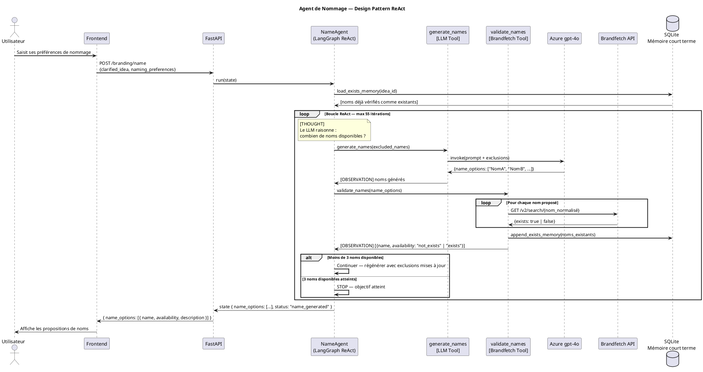
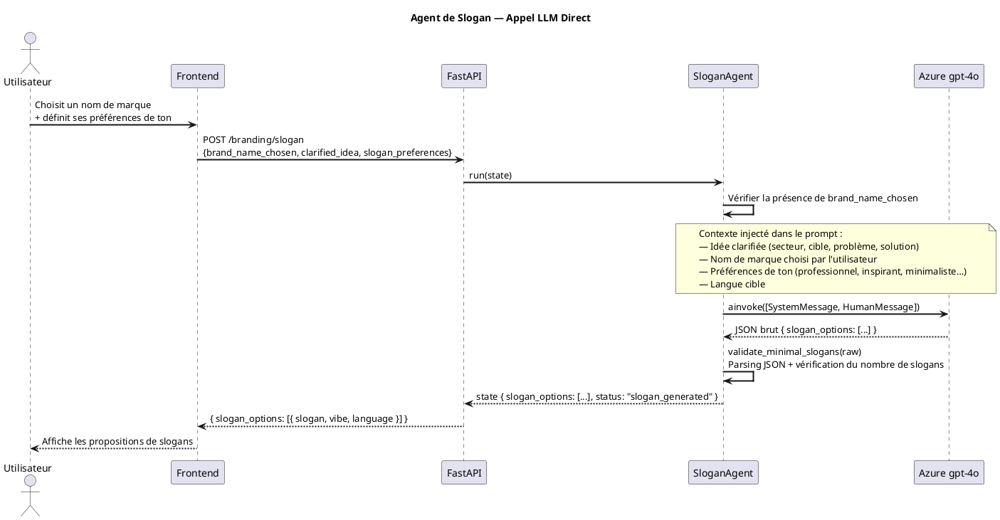
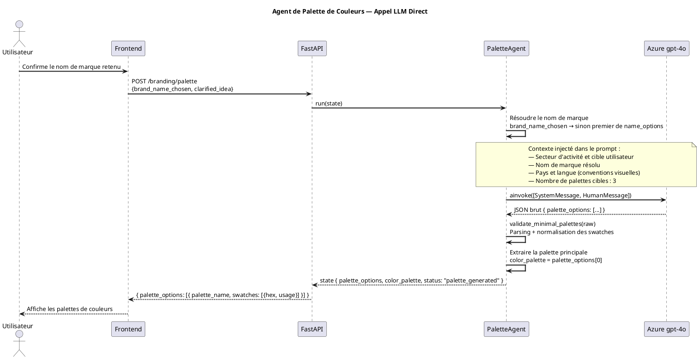
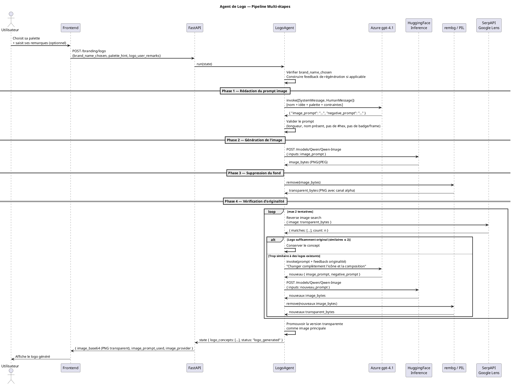
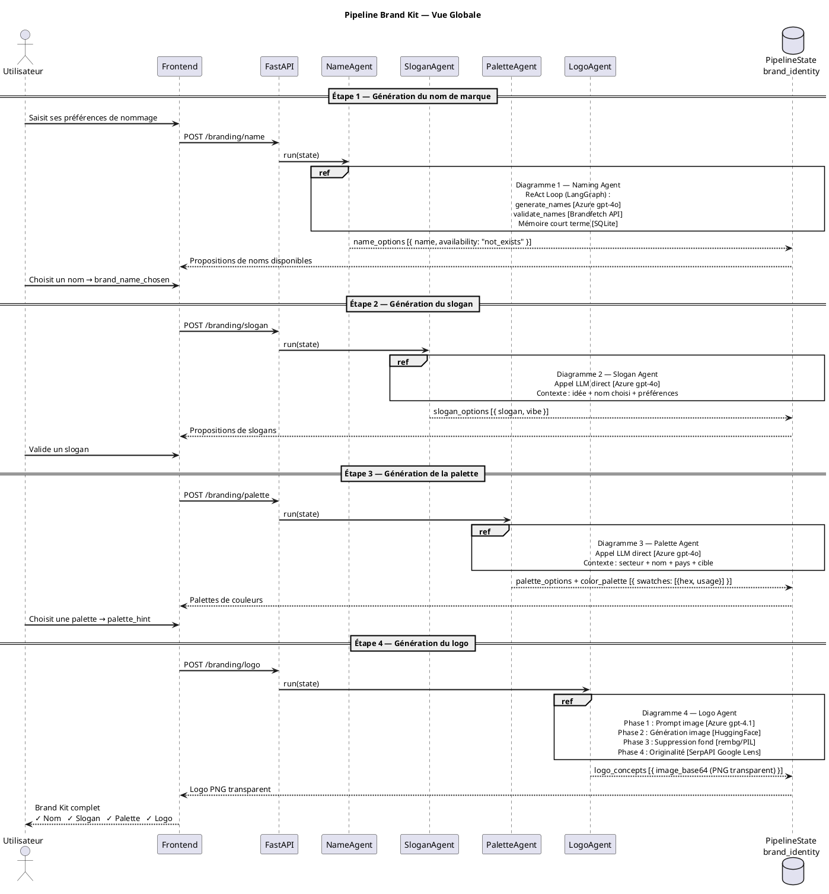

# Diagrammes de Séquence — Brand Kit (PlantUML)

---

## Diagramme 1 — Agent de Nommage (ReAct)

---

## Diagramme 2 — Agent de Slogan

---

## Diagramme 3 — Agent de Palette de Couleurs

---

## Diagramme 4 — Agent de Logo

---

## Diagramme 5 — Vue Globale Brand Kit (avec refs)

---

## Notes de rendu

Ces diagrammes sont à générer via :
- **PlantUML Online** : https://www.plantuml.com/plantuml/uml/
- **VS Code** : extension *PlantUML* (Ctrl+Shift+P → Preview Current Diagram)
- **IntelliJ / PyCharm** : plugin *PlantUML Integration*
- **Ligne de commande** : `java -jar plantuml.jar DIAGRAMS_PLANTUML.md`
